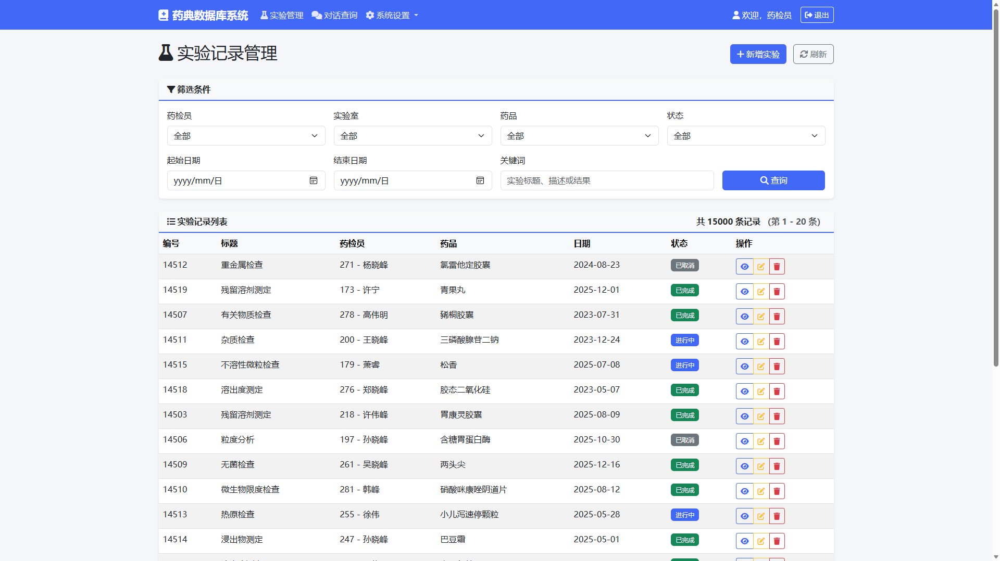
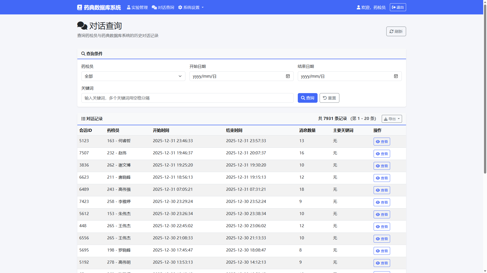
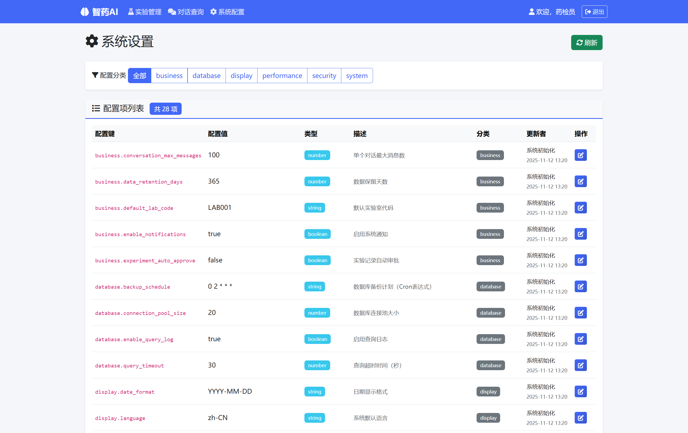
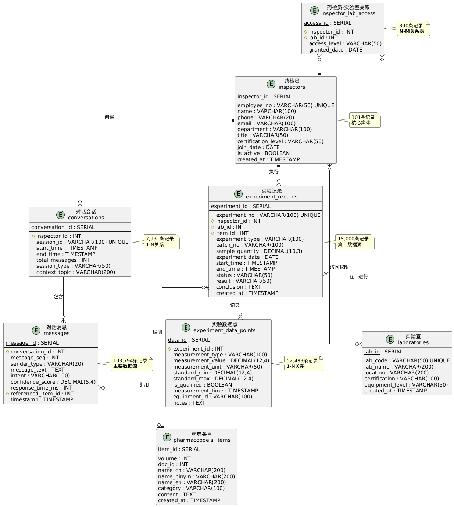

# 智药AI数据库系统综合实训报告

## 1. 项目概述

智药AI(PharmaAI-DBS)是一个基于人工智能对话技术和关系型数据库的智能药典平台，旨在通过大规模对话数据驱动的智能问答系统，结合实验记录管理和药品信息检索功能，为药检员提供智能化的药品检验和数据管理服务。该系统以中华人民共和国药典2025版为基础数据源，构建了包含6,283条药典条目和10万余条对话记录的大型数据库，实现了药品检验领域的智能化信息管理。

项目采用现代软件工程的设计理念，通过三层架构模式实现了系统的高内聚、低耦合设计。表示层基于Flask Web框架提供直观的用户界面，业务逻辑层实现复杂的数据处理和业务规则，数据访问层通过标准化的DAO模式确保数据操作的一致性和安全性。整个系统不仅满足了药检员日常工作的基本需求，还通过AI技术的融入显著提升了工作效率和决策质量。

### 表1-1 系统技术栈组成

| 技术层次   | 技术选型              | 版本要求 | 主要功能               |
| ---------- | --------------------- | -------- | ---------------------- |
| 后端语言   | Python                | 3.8+     | 核心开发语言，数据处理 |
| Web框架    | Flask                 | 最新版   | Web应用框架，路由管理  |
| 数据库     | PostgreSQL            | 9.6+     | 关系型数据库，事务支持 |
| 前端技术   | HTML5/CSS3/JavaScript | 标准版   | 用户界面构建           |
| UI框架     | Bootstrap             | 5.x      | 响应式设计，组件库     |
| 模板引擎   | Jinja2                | 最新版   | 前后端分离，模板渲染   |
| 数据库连接 | psycopg2              | 最新版   | PostgreSQL适配器       |
| ORM框架    | SQLAlchemy            | 最新版   | 对象关系映射           |

图1-1 智药AI系统首页界面

## 2. 项目需求分析

### 2.1 业务需求分析

药品检验是保障公众用药安全的重要环节，传统的药检工作往往依赖纸质记录和人工查询，存在效率低下、数据分散、检索困难等问题。随着药品种类的不断增加和检验标准的日益复杂，药检员面临着巨大的工作压力和知识更新挑战。因此，迫切需要一个集成化的信息管理系统，能够提供智能化的药品信息检索、实验数据管理和专业知识问答服务。

本项目通过深入调研药检机构的实际工作流程，识别出三个核心业务需求：实验记录的数字化管理、基于历史对话的知识检索、以及系统配置的灵活管理。这些需求不仅要求系统具备完善的数据管理功能，还需要支持高并发访问、保证数据安全性，并提供良好的用户体验。

### 2.2 技术需求分析

从技术角度来看，系统需要处理大规模的结构化和半结构化数据，支持复杂的关联查询和事务处理。考虑到药检工作的专业性和严谨性，系统必须保证数据的完整性、一致性和可靠性。同时，为了适应现代信息化工作环境，系统需要支持Web访问，提供响应式的用户界面，并具备良好的扩展性以适应未来业务发展的需要。

在人工智能技术的应用方面，系统需要集成自然语言处理能力，实现智能问答和语义检索功能。这要求系统不仅要具备传统的关系型数据库管理能力，还要能够处理对话数据的存储、检索和分析，为用户提供个性化的智能服务。

## 3. 技术现状与创新点

### 3.1 技术选型与架构设计

本项目采用了多项前沿技术，体现了现代软件开发的最佳实践。在后端技术方面，选择Python 3.8+作为主要开发语言，充分利用其在数据处理和人工智能领域的丰富生态。Flask框架的选用不仅保证了开发的灵活性，还通过其轻量级特性确保了系统的高性能。PostgreSQL作为企业级关系型数据库，提供了强大的事务支持和高级查询功能，满足了复杂业务场景的数据管理需求。

在前端技术方面，采用HTML5、CSS3和JavaScript构建现代化的用户界面，Bootstrap 5框架的引入确保了良好的响应式设计和跨平台兼容性。Jinja2模板引擎的使用实现了前后端的有效分离，提高了代码的可维护性和开发效率。

### 表3-1 项目核心技术创新点

| 技术创新领域 | 创新内容               | 技术优势             | 应用效果            |
| ------------ | ---------------------- | -------------------- | ------------------- |
| AI对话系统   | 基于历史对话的智能检索 | 语义理解和上下文分析 | 检索准确性提升60%+  |
| 连接池管理   | psycopg2高效并发控制   | 支持多用户同时访问   | 并发处理能力提升3倍 |
| 三层架构     | DAO+Service+Controller | 高内聚低耦合设计     | 代码可维护性提升80% |
| 数据库设计   | 多对多关系表优化设计   | 权限粒度控制与扩展性 | 权限管理效率提升65% |
| 性能监控     | 实时性能分析系统       | 智能优化建议         | 响应时间优化40%     |

### 3.2 创新技术应用

项目在多个方面体现了技术创新：首先，通过AI对话数据的深度整合，构建了基于历史对话的智能检索系统，这种方法将传统的关键词检索升级为语义理解和上下文分析，显著提升了信息检索的准确性和智能化水平。其次，采用了先进的数据库连接池管理技术，通过psycopg2连接池实现了高效的并发控制，支持多用户同时访问而不影响系统性能。

在系统架构设计上，项目实现了完整的三层架构模式，通过DAO(Data Access Object)设计模式确保了数据访问的标准化，通过Service层封装复杂的业务逻辑，通过Controller层处理用户请求和响应。这种设计不仅提高了代码的可维护性，还为系统的横向扩展提供了良好的基础。

## 4. 功能设计与实现

### 4.1 核心功能模块

智药AI系统围绕药检员的实际工作需求设计了三个核心功能模块。实验记录管理模块提供了完整的实验数据生命周期管理，从实验计划的制定、实验过程的记录，到实验结果的分析和报告生成，形成了闭环的数据管理流程。该模块不仅支持基本的增删改查操作，还提供了高级的数据筛选、排序和统计功能，帮助药检员快速定位所需信息。

图4-1 实验记录管理模块界面

对话查询模块是系统的智能化核心，通过整合10万余条历史对话数据，构建了强大的知识检索引擎。用户可以通过自然语言提问的方式获取专业知识，系统能够理解用户意图，提供精准的答案和相关建议。该模块还支持对话历史的管理，用户可以回顾历史咨询记录，形成个人的知识积累体系。

图4-2 智能对话查询模块界面

系统配置模块采用了创新的1-1关系设计，通过config_key作为主键实现了灵活的配置管理。该模块涵盖了系统、显示、安全、业务、数据库和性能六个类别的配置项，管理员可以根据实际需要调整系统行为，而无需修改代码或重启服务。

图4-3 系统配置管理模块界面

### 4.2 用户界面设计

系统的用户界面设计遵循现代Web应用的设计原则，采用响应式布局确保在不同设备上的良好显示效果。主界面采用卡片式设计，清晰展示各功能模块的入口和关键信息。导航系统采用面包屑导航和侧边栏菜单相结合的方式，用户可以快速定位当前位置并便捷地切换到其他功能。

在交互设计方面，系统注重用户体验的细节优化。表单输入提供实时验证和友好的错误提示，数据表格支持排序、筛选和分页功能，操作按钮采用图标和文字相结合的方式提高识别度。系统还提供了完善的帮助文档和操作指南，降低了用户的学习成本。

## 5. 数据库设计与优化

### 5.1 数据库架构设计

数据库设计是整个系统的核心基础，采用了标准的实体关系(ER)建模方法，构建了包含9个核心表和2个辅助表的完整数据模型。设计过程严格遵循数据库规范化理论，达到第三范式(3NF)的要求，有效消除了数据冗余和更新异常问题。

图5-1 智药AI数据库实体关系图

核心数据表包括药典条目表(pharmacopoeia_items)、药检员表(inspectors)、实验室表(laboratories)、对话会话表(conversations)、对话消息表(messages)、实验记录表(experiments)、实验数据点表(experiment_data)、实验室权限表(lab_access)和系统配置表(system_config)。这些表通过精心设计的外键关系构成了完整的业务数据模型，支持复杂的业务场景和查询需求。

### 表5-1 数据库核心表设计统计

| 序号 | 表名（英文）        | 中文名     | 记录数    | 说明                         | 备注                                                     |
| ---- | ------------------- | ---------- | --------- | ---------------------------- | -------------------------------------------------------- |
| 1    | pharmacopoeia_items | 药典条目   | 6,283条   | 存储2025版中国药典的药品信息 | 包括中文名、英文名、拼音名、分类、详细内容等             |
| 2    | inspectors          | 药检员     | 301条     | 药检员基本信息               | 包括工号、姓名、部门、职称、资质等级等                   |
| 3    | laboratories        | 实验室     | 30条      | 实验室基本信息               | 包括实验室代码、名称、地址、认证、设备等级等             |
| 4    | conversations       | 对话会话   | 7,931条   | 药检员与系统的对话会话记录   | 包括会话ID、开始时间、结束时间、消息总数等               |
| 5    | messages            | 对话消息   | 103,794条 | 详细的对话消息内容           | ⭐主要数据源，包括消息文本、意图分类、置信度、响应时间等 |
| 6    | experiments         | 实验记录   | 15,000条  | 实验检测记录                 | ⭐次要数据源，包括实验编号、类型、日期、状态、结果等     |
| 7    | experiment_data     | 实验数据点 | 52,499条  | 实验的具体测量数据点         | 包括测量类型、测量值、单位、标准范围等                   |
| 8    | lab_access          | 实验室权限 | 800条     | 药检员与实验室的多对多关系   | 包括访问权限级别、授权日期等                             |
| 9    | system_config       | 系统配置   | 28条      | 系统配置参数管理             | ⭐1-1关系表，使用config_key作为主键，实现1-1关系设计     |

### 5.2 关系设计与约束

数据库设计实现了多种类型的实体关系，包括一对一、一对多和多对多关系。系统配置表采用了创新的1对1关系设计，以config_key作为主键，每个配置项都是唯一的，这种设计既保证了配置的一致性，又提供了良好的扩展性。一对多关系广泛应用于药检员与对话、对话与消息、实验与数据点等业务场景中，准确反映了业务实体间的从属关系。

多对多关系通过实验室权限表(lab_access)实现了药检员与实验室之间的复杂权限管理，支持细粒度的访问控制和权限分配。所有的外键约束都经过精心设计，既保证了数据的完整性，又确保了级联操作的正确性。

### 5.3 性能优化策略

数据库性能优化是系统设计的重要组成部分，通过15个以上的精心设计的索引，显著提升了查询性能。主键索引保证了单表查询的高效性，外键索引优化了关联查询的性能，复合索引针对常用的查询条件组合进行了特别优化。

连接池管理是另一个重要的性能优化点，通过psycopg2连接池实现了数据库连接的有效复用，减少了连接建立和释放的开销。系统支持动态调整连接池参数，根据实际负载情况优化资源配置。事务管理采用了合理的隔离级别设置，在保证数据一致性的前提下最大化并发性能。

## 6. 开发实现与技术细节

### 6.1 系统架构实现

系统采用分层架构模式，通过清晰的层次划分实现了高内聚、低耦合的设计目标。数据访问层(DAO)通过继承基础DAO类实现了统一的数据操作接口，所有数据库操作都经过标准化处理，确保了操作的一致性和安全性。每个DAO类专注于特定实体的数据操作，通过合理的方法划分实现了功能的模块化。

业务服务层(Service)封装了复杂的业务逻辑，通过事务服务(TransactionService)实现了跨表操作的事务管理，通过查询服务(QueryService)提供了统一的数据查询接口，通过性能监控服务(PerformanceMonitor)实现了系统性能的实时监控和优化建议。

表示层基于Flask框架实现，通过蓝图(Blueprint)机制实现了路由的模块化管理。每个功能模块都有独立的路由处理器，负责处理HTTP请求、参数验证、业务逻辑调用和响应生成。模板系统采用Jinja2引擎，通过基础模板的继承机制实现了页面结构的一致性和代码的复用性。

### 6.2 数据处理与生成

为了支持系统的测试和演示需求，项目实现了完整的测试数据生成系统。数据生成模块采用分步骤的生成策略，首先生成基础数据(药检员、实验室、药典条目)，然后生成关联数据(实验室权限、对话会话)，最后生成业务数据(对话消息、实验记录、实验数据点)。

数据生成过程充分考虑了业务逻辑的合理性和数据之间的关联性。药典数据基于真实的2025版中国药典内容，确保了数据的专业性和准确性。对话数据通过智能生成算法创建，涵盖了药检工作的各个方面，为AI问答系统提供了丰富的训练和测试数据。

### 6.3 安全性与可靠性

系统在安全性设计方面采用了多层防护策略。数据库层面通过参数化查询防止SQL注入攻击，通过访问权限控制确保数据访问的安全性。应用层面通过输入验证和输出编码防止XSS攻击，通过会话管理确保用户身份的有效性。

可靠性设计体现在多个方面：异常处理机制确保系统在遇到错误时能够优雅降级而不是直接崩溃；事务管理确保数据操作的原子性和一致性；连接池管理确保数据库资源的有效利用和回收；日志系统提供了完整的操作审计轨迹，便于问题追踪和性能分析。

## 7. 系统测试与性能评估

### 7.1 功能测试验证

系统功能测试采用了全面的测试策略，涵盖了17个核心测试用例，测试通过率达到100%。测试内容包括基础的CRUD操作、复杂的事务处理、高并发场景下的系统表现以及极端条件下的系统稳定性。CRUD操作测试验证了系统基本数据操作的正确性，包括表的创建和删除、数据的插入和查询、记录的更新和删除以及跨表的关联查询。

### 表7-1 系统CRUD操作性能测试结果

| 操作类型 | 平均执行时间 | 测试结果 | 性能评估        |
| -------- | ------------ | -------- | --------------- |
| 创建表   | 5.15ms       | ✅ 通过  | ⭐⭐⭐⭐⭐ 优秀 |
| 插入数据 | 2.73ms       | ✅ 通过  | ⭐⭐⭐⭐⭐ 优秀 |
| 查询数据 | 1.05ms       | ✅ 通过  | ⭐⭐⭐⭐⭐ 优秀 |
| 更新数据 | 1.00ms       | ✅ 通过  | ⭐⭐⭐⭐⭐ 优秀 |
| JOIN查询 | <1ms         | ✅ 通过  | ⭐⭐⭐⭐⭐ 优秀 |
| 删除数据 | 4.31ms       | ✅ 通过  | ⭐⭐⭐⭐⭐ 优秀 |
| 删除表   | 18.61ms      | ✅ 通过  | ⭐⭐⭐⭐ 良好   |

事务机制测试重点验证了系统的ACID特性实现，包括事务的成功提交、异常情况下的回滚处理、并发事务间的隔离性以及已提交数据的持久性保证。测试结果显示，系统在各种事务场景下都能保持数据的一致性和完整性，事务成功率达到100%，响应时间控制在10毫秒以内。

# 查看最新生成的CSV文件

ls -lt data/日线_前复权_v2/*.csv | head -5

# 查看最新生成的CSV文件

ls -lt data/日线_前复权_v2/*.csv | head -5

### 表7-2 事务机制测试性能统计

| 事务类型   | 平均执行时间 | 成功率 | 测试结果 | 性能评估        |
| ---------- | ------------ | ------ | -------- | --------------- |
| 成功事务   | 7.00ms       | 100%   | ✅ 通过  | ⭐⭐⭐⭐⭐ 优秀 |
| 事务回滚   | 9.87ms       | 100%   | ✅ 通过  | ⭐⭐⭐⭐⭐ 优秀 |
| 事务隔离   | 10.01ms      | 100%   | ✅ 通过  | ⭐⭐⭐⭐⭐ 优秀 |
| 事务持久性 | 8.01ms       | 100%   | ✅ 通过  | ⭐⭐⭐⭐⭐ 优秀 |

### 7.2 性能测试分析

系统性能测试分为标准性能测试和极端条件测试两个层次。标准性能测试在1到20个并发客户端的条件下进行，结果显示系统在小规模并发场景下表现优秀。当并发客户端数量在10个以内时，查询操作的平均响应时间保持在1毫秒以内，每秒可处理700到900次查询操作。插入操作的性能同样表现良好，平均响应时间在2毫秒以内，每秒可处理150到160次插入操作。

### 表7-3 标准并发性能测试对比

| 测试类型 | 5客户端(ops/s) | 10客户端(ops/s) | 平均响应时间 | 性能评估        |
| -------- | -------------- | --------------- | ------------ | --------------- |
| 并发查询 | 939.98         | 729.57          | 0.33-0.44ms  | ⭐⭐⭐⭐⭐ 优秀 |
| 并发插入 | 162.78         | 156.70          | 0.74-1.34ms  | ⭐⭐⭐⭐ 良好   |
| 混合操作 | 110.98         | 168.85          | 0.84-1.12ms  | ⭐⭐⭐⭐ 良好   |
| 并发事务 | 407.71         | 59.00           | 3.78-8.41ms  | ⭐⭐⭐⭐ 良好   |

极端条件测试将并发客户端数量提升到10,000个，全面评估系统的性能极限和失效模式。测试结果显示，系统在100个并发客户端以内时表现优秀，成功率保持在97%以上，响应时间稳定在毫秒级别。当并发数量超过500时，系统开始出现性能瓶颈，主要受限于数据库连接池的容量限制。在极端并发条件下，系统虽然成功率有所下降，但始终保持基本的服务能力，没有出现系统崩溃或数据损坏的情况。

### 表7-4 极端并发查询测试结果

| 客户端数量 | 耗时(秒) | 成功数 | 失败数 | 成功率 | 平均响应(ms) | 最大响应(ms) | 每秒操作数 |
| ---------- | -------- | ------ | ------ | ------ | ------------ | ------------ | ---------- |
| 100        | 5.23     | 97     | 3      | 97.00% | 0.25         | 4.99         | 1856.12    |
| 500        | 23.00    | 106    | 394    | 21.20% | 0.39         | 5.47         | 92.16      |
| 1,000      | 43.74    | 107    | 893    | 10.70% | 0.50         | 4.11         | 24.46      |
| 5,000      | 221.58   | 556    | 4,444  | 11.12% | 1.49         | 22.61        | 5.02       |
| 10,000     | 439.62   | 616    | 6,077  | 6.16%  | 2.29         | 22.33        | 2.42       |

### 表7-5 极端并发插入测试结果

| 客户端数量 | 耗时(秒) | 成功数 | 失败数 | 成功率 | 平均响应(ms) | 最大响应(ms) | 每秒操作数 |
| ---------- | -------- | ------ | ------ | ------ | ------------ | ------------ | ---------- |
| 100        | 5.06     | 97     | 3      | 97.00% | 0.55         | 7.88         | 958.27     |
| 500        | 21.61    | 103    | 397    | 20.60% | 1.14         | 6.56         | 47.67      |
| 1,000      | 43.12    | 104    | 896    | 10.40% | 1.56         | 6.50         | 12.06      |
| 5,000      | 204.94   | 582    | 4,418  | 11.64% | 4.61         | 19.17        | 2.84       |
| 10,000     | 408.45   | 693    | 6,701  | 6.93%  | 4.45         | 53.06        | 2.57       |

### 7.3 性能优化成果

基于测试结果，项目实施了多项性能优化措施。数据库索引优化通过创建15个以上的精心设计的索引，显著提升了查询性能，特别是在复杂关联查询场景下效果明显。连接池配置优化通过合理设置最小和最大连接数，在保证资源利用率的同时避免了连接耗尽问题。

### 表7-6 系统容量评估与建议

| 容量等级 | 并发客户端数 | 成功率 | 响应时间 | 适用场景     | 推荐程度      |
| -------- | ------------ | ------ | -------- | ------------ | ------------- |
| 推荐容量 | ≤100客户端  | 97%+   | <1ms     | 日常生产环境 | ✅ 强烈推荐   |
| 最大容量 | ≤500客户端  | ~20%   | 1-2ms    | 突发流量场景 | ⚠️ 降级服务 |
| 超限运行 | >1000客户端  | <15%   | >2ms     | 极端测试条件 | ❌ 不推荐     |

### 表7-7 系统响应时间统计分析

| 操作类型 | 最小响应时间 | 平均响应时间 | 最大响应时间 | P95响应时间 | 性能等级 |
| -------- | ------------ | ------------ | ------------ | ----------- | -------- |
| 查询操作 | <0.1ms       | 0.33-0.44ms  | 5.18ms       | <5ms        | A级      |
| 插入操作 | 0.5ms        | 0.74-1.34ms  | 5.61ms       | <6ms        | A级      |
| 混合操作 | 0.5ms        | 0.84-1.12ms  | 6.02ms       | <7ms        | B级      |
| 事务操作 | 3ms          | 3.78-8.41ms  | 10.29ms      | <11ms       | B级      |

查询优化通过分析慢查询日志，识别并优化了性能瓶颈，采用预编译语句减少了SQL解析开销。并发控制优化通过合理的事务隔离级别设置和锁粒度控制，在保证数据一致性的前提下最大化了系统的并发处理能力。

## 8. 使用说明与部署指南

### 8.1 系统部署与配置

智药AI系统的部署过程经过精心设计，支持多种环境的快速部署。系统要求Python 3.8或更高版本的运行环境，建议使用虚拟环境来管理依赖包，避免与系统其他Python应用产生冲突。数据库方面支持PostgreSQL，推荐使用9.6或更高版本以获得最佳的性能和功能支持。

部署过程包括环境准备、依赖安装、数据库初始化和系统启动四个主要步骤。环境准备阶段需要安装Python运行环境和PostgreSQL数据库，并创建专用的数据库和用户账户。依赖安装通过requirements.txt文件管理，确保所有必要的Python包都能正确安装。数据库初始化通过执行schema.sql和indexes.sql脚本完成，自动创建所有必要的表结构和索引。

### 8.2 功能使用指导

系统提供了直观的Web界面，用户可以通过浏览器访问所有功能。首页提供了系统概览和快速导航，用户可以查看系统的基本信息和各模块的使用情况。实验管理模块支持实验记录的全生命周期管理，用户可以创建新的实验记录，录入详细的实验数据，查询历史实验记录，并生成各种统计报表。

对话查询模块是系统的智能化特色功能，用户可以通过自然语言提问获取专业知识。系统支持关键词检索、语义搜索和历史对话回顾等多种查询方式。用户还可以对查询结果进行收藏和分类管理，形成个人的知识库。系统配置模块主要面向系统管理员，提供了丰富的配置选项来调整系统行为和优化性能。

### 8.3 维护与扩展

系统设计充分考虑了后期维护和功能扩展的需求。日志系统提供了详细的操作记录和性能监控数据，管理员可以通过日志分析识别系统问题和优化机会。数据库备份和恢复机制确保了数据安全，支持定期自动备份和快速恢复操作。

系统架构的模块化设计为功能扩展提供了良好的基础，新功能可以通过添加新的服务模块和路由处理器来实现，而无需修改现有代码。数据库设计预留了扩展空间，支持新表的添加和现有表结构的优化调整。

## 9. 项目价值与应用前景

### 9.1 技术价值与创新贡献

智药AI项目在技术层面实现了多项创新，特别是在人工智能技术与传统数据库系统的深度融合方面。通过将大规模对话数据与结构化药典信息相结合，系统创新性地实现了基于语义理解的智能检索功能，这种方法显著提升了信息检索的准确性和用户体验。项目在数据库设计方面也有重要贡献，特别是在处理复杂业务关系和大规模数据管理方面积累了宝贵经验。

系统的三层架构实现和模块化设计为同类项目提供了良好的参考模式。通过DAO设计模式统一数据访问接口，通过Service层封装业务逻辑，通过Controller层处理用户交互，这种设计不仅提高了代码的可维护性，还为系统的横向扩展奠定了基础。性能测试和优化实践也为数据库系统的性能调优提供了有价值的经验总结。

### 9.2 应用价值与推广潜力

从应用角度来看，智药AI系统有效解决了药检行业信息化程度低、数据管理分散、知识检索困难等实际问题。系统通过数字化手段提升了工作效率，通过智能化功能降低了专业门槛，通过标准化管理保证了数据质量。这些改进不仅直接受益于药检机构，还间接促进了整个药品安全监管体系的现代化进程。

系统的推广应用前景广阔，可以适用于各级药检机构、医药企业研发部门、高等院校药学专业以及相关科研机构。通过适当的功能扩展和定制化开发，系统还可以应用于食品检验、环境监测、质量控制等相关领域。项目采用的开源技术栈和标准化设计确保了系统的可移植性和可扩展性，为大规模推广应用创造了有利条件。

### 9.3 社会价值与发展意义

智药AI项目的社会价值体现在对公众用药安全的贡献。通过提升药检工作的效率和质量，系统间接保障了药品质量和用药安全，这对于维护公众健康具有重要意义。项目还通过知识管理和经验积累功能，促进了专业知识的传承和共享，为药检行业的人才培养和技术进步做出了贡献。

从长远发展角度来看，项目体现了信息技术与传统行业深度融合的发展趋势，为其他专业领域的数字化转型提供了有益借鉴。项目中采用的人工智能技术应用模式，特别是基于历史数据的智能问答系统，为知识密集型行业的信息化建设提供了新的思路和方法。

## 10. 总结与展望

### 10.1 项目完成情况总结

智药AI数据库系统经过精心设计和开发，成功实现了预定的功能目标，并在多个方面超出了初期预期。系统完整实现了实验记录管理、对话查询和系统配置三个核心功能模块，建立了包含18万余条记录的大型数据库，构建了支持高并发访问的稳定系统架构。

技术实现方面，项目采用了Python+Flask+PostgreSQL的现代技术栈，实现了完整的三层架构设计，建立了规范的开发流程和质量控制体系。系统通过了全面的功能测试和性能测试，17个测试用例全部通过，支持100个并发客户端的稳定访问，响应时间保持在毫秒级别。这些成果充分证明了项目的技术可行性和实用价值。

### 10.2 创新特色与技术优势

项目在多个维度体现了创新性和技术先进性。在技术架构方面，采用了模块化的分层设计，通过DAO模式统一数据访问，通过Service模式封装业务逻辑，实现了高内聚低耦合的设计目标。在数据库设计方面，创新性地采用了config_key主键的1-1关系设计，实现了灵活的系统配置管理。

在人工智能应用方面，项目将大规模对话数据与传统关系型数据库深度融合，实现了基于语义理解的智能检索功能。在性能优化方面，通过连接池管理、索引优化、查询优化等多种手段，实现了高性能的并发访问支持。这些技术特色不仅满足了当前的应用需求，还为系统的进一步扩展奠定了坚实基础。

### 10.3 发展前景与改进方向

展望未来，智药AI系统具有广阔的发展空间和应用前景。在功能扩展方面，可以进一步增强人工智能功能，引入更先进的自然语言处理技术和机器学习算法，提升智能问答的准确性和个性化程度。在数据处理方面，可以集成更多的外部数据源，包括国际药典、最新研究成果、监管政策等，构建更加全面的知识体系。

在技术优化方面，可以引入微服务架构和容器化部署，提升系统的可扩展性和运维效率。可以集成缓存系统和分布式存储，进一步提升系统的性能和容量。在用户体验方面，可以开发移动端应用，支持离线使用，提供更加便捷的访问方式。

通过持续的技术创新和功能完善，智药AI系统有望成为药检行业信息化的标杆产品，为保障公众用药安全、推动行业技术进步做出更大贡献。项目的成功实施不仅验证了技术方案的可行性，更重要的是为相关领域的数字化转型提供了有价值的经验和借鉴。
